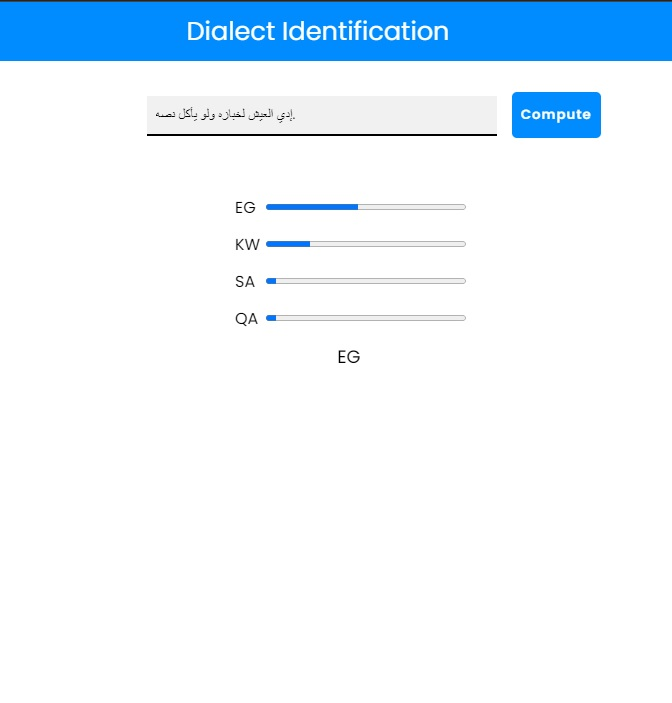

    # Arabic-Dialect-Identification

Araibic Dialect Identification is a NLP Problem to classify different 18 arabic dialect, 'IQ', 'LY', 'QA', 'PL', 'SY', 'TN', 'JO', 'MA', 'SA', 'YE', 'DZ',
       'EG', 'LB', 'KW', 'OM', 'SD', 'AE' and 'BH'.
       
The dataset used is the **QADI** dataset, which initially consists of 2 columns id and dialect.
       
Abstractly, the Project is divided into **4 stages**.

 # Stage 1 (Data Fetching)
 
 This stage mainly fetches the tweets from an API using the given ids.
 
 # Stage 2 (Data Pre-processing and Analysis)
  
 in this stage, different data science techniques are used to make  **Analysis, Visualization, Encoding, Feature extraction** on the dataset.
 
 # Stage 3 (Model Training)
 
 **4 different models** are trained on the preprocessed dataset in **2 different approaches**
 
1. The **1st approach** is to train on the **Features Extracted** on pre-processing stage.
3 models are included in this approach: **Logisitic Regression** , **Naive Bayes** , **Deep Learning Model**

2. the **2nd approach** is to train on encoded texts itself, in other words, let the model extract the features himself.
**Recurrent Neural Network** is the one used in this approach

3. **Accuracy** is measured based on Categorical accuracy and F1-Score
in 1 approach the DL could achieve about 38% categorical accuracy, whereas the Naive Bayes and logistic regressing could achieve about 37%
However 2nd approach performs better with an accuracy about 50% . (For more details check the training notebook)

# Stage 4 (Deployment)

Deploying the model using Flask as a back end. HTML and CSS as front end.

  

**Technologies** used are: Numpy, Pandas, Seaborn, NLTK, SKLearn and TensorFlow.

 

 
  
 

 

